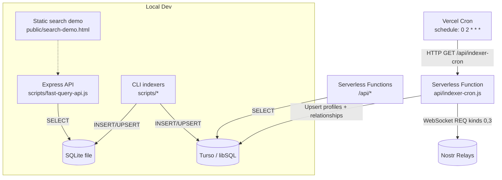
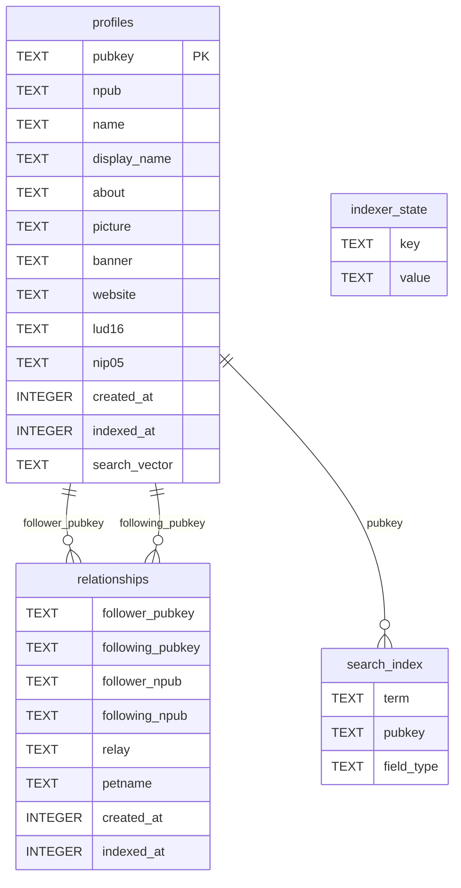

# Nostr Indexer API (Vercel + Turso)

A production-ready Nostr indexer that periodically ingests profiles and contact lists from public relays and serves fast search and relationship queries from Turso (libSQL). Runs on Vercel Serverless Functions with a scheduled Vercel Cron job. Includes local workflows: backfilling directly to Turso, or trying everything locally with SQLite and a dev Express API.

## Highlights

- Serverless by default: clean Vercel Functions under `/api/*`
- Periodic indexing: Vercel Cron safely ingests recent profile (kind 0) and contacts (kind 3)
- Turso-backed: libSQL-compatible, token-auth, serverless SQLite
- Simple REST API: health, profile search, follower/following, user stats, indexer stats
- Local-friendly: CLI indexers, optional local SQLite + Express API and search demo

## Architecture



### Entity model (serverless/Turso)



## Requirements

- Node.js >= 18 (engines enforced)
- A Turso database (url + auth token) for serverless deployment

## Environment Variables

Required (serverless and CLI to Turso):
- `TURSO_DATABASE_URL`: e.g. `libsql://<db-name>-<org>.turso.io`
- `TURSO_AUTH_TOKEN`: a token with read/write access

Optional (indexer behavior – api/indexer-cron.js):
- `INDEXER_RELAYS`: comma-separated relay URLs; defaults are built in
- `INDEXER_MAX_EVENTS`: default 60
- `INDEXER_MAX_EVENTS_PER_RELAY`: default 30
- `INDEXER_MAX_RUNTIME_MS`: default 2500 (per-relay safety window)
- `INDEXER_MAX_RELAYS_PER_RUN`: default 1
- `INDEXER_TOTAL_RUNTIME_MS`: default 9000 (run budget)

Optional (local dev):
- `LOCAL_DB_PATH`: path for local SQLite file (defaults to `db/../nostr_indexer.db`)

## API Reference (Vercel)

Base URL: your Vercel deployment

- Health
  - `GET /api/health` → `{ success: true, data: "OK" }`
  - If Turso env vars are present, a quick `SELECT 1` is executed; otherwise returns OK.

- Indexer Stats
  - `GET /api/indexer-stats`
  - Response: `{ success, data: { total_profiles, total_relationships, search_index_size, relays_indexed, last_indexed }, error }`

- Search profiles
  - `GET /api/search?q=<query>&page=<n>&per_page=<m>`
  - Query is tokenized; terms shorter than 3 chars are ignored
  - `per_page` is clamped to 1..100 (default 20)
  - Response: `{ success, data: { profiles: [...], total_count, page, per_page }, error }`
  - Each profile includes: `pubkey, name, display_name, about, picture, banner, website, lud16, nip05, created_at, indexed_at`

- Profile by id
  - `GET /api/profile/<pubkey-or-npub>`
  - Accepts hex pubkey or `npub` string
  - Response: `{ success, data: { ...profileFields }, error }`

- Relationships (hex pubkey required)
  - `GET /api/following/<pubkey>?limit=100` → ordered by `created_at` desc
  - `GET /api/followers/<pubkey>?limit=100` → ordered by `created_at` desc
  - Response: `{ success, data: [ { follower_pubkey, following_pubkey, relay, petname, created_at, indexed_at }... ], error }`
  - Note: these endpoints expect a hex pubkey id

- User Stats
  - `GET /api/stats/<pubkey>` → `{ success, data: { following_count, followers_count, last_contact_update }, error }`
  - `last_contact_update` may be null

### Example requests

```bash
# Health
curl -sS https://<your-domain>/api/health | jq

# Indexer stats
curl -sS https://<your-domain>/api/indexer-stats | jq

# Search (page 0, 20 per page)
curl -sS "https://<your-domain>/api/search?q=jack&page=0&per_page=20" | jq

# Profile by npub
curl -sS https://<your-domain>/api/profile/npub1... | jq

# Followers (hex pubkey)
curl -sS https://<your-domain>/api/followers/<64-hex-pubkey>?limit=50 | jq
```

## Indexing Job (Cron)

Endpoint: `GET /api/indexer-cron` (invoked by Vercel Cron and can be called manually)

- Subscribes to relays for recent kind 0 (profiles) and kind 3 (contacts)
- Applies per-run and per-relay caps and time budgets
- Upserts profiles and relationships via DB managers
- Updates `indexer_state` keys: `last_indexed`, `relays_indexed_last_run`, `events_indexed_last_run`

Query overrides (all optional):
- `since=<unix-seconds>` – default is last run minus 60s overlap, else past hour
- `limit=<n>` – cap total events this run (default `INDEXER_MAX_EVENTS`)
- `per_relay=<n>` – per-relay event cap (default `INDEXER_MAX_EVENTS_PER_RELAY`)
- `relays=<n>` – number of relays to try this run (default `INDEXER_MAX_RELAYS_PER_RUN`)
- `subs_limit=<n>` – subscription limit per kind (default 10)
- `only=profiles|contacts` – restrict event kinds
- `runtime_ms=<n>` – per-relay runtime budget (default `INDEXER_MAX_RUNTIME_MS`)

Safety & idempotency:
- `INSERT OR REPLACE` on profiles and relationships
- 60s overlap window when computing `since` to withstand cron jitter

## Quickstart

### 1) Install dependencies

```bash
npm install
```

### 2) Configure environment

```bash
export TURSO_DATABASE_URL=libsql://<db-name>-<org>.turso.io
export TURSO_AUTH_TOKEN=<token>
# Optional
export INDEXER_RELAYS=wss://relay.damus.io,wss://nos.lol
```

### 3) Initialize Turso schema (idempotent)

```bash
npm run db:migrate
# or
node db/migrate.js
```

### 4) Backfill data into Turso (from your machine)

Use the Turso-backed backfill (writes directly to Turso via HTTP):

```bash
# General run (profiles + contacts)
npm run index:backfill:turso -- --limit=20000 --perRelay=2000 --since=$(($(date +%s)-604800))

# Profiles only
npm run index:profiles -- --limit=50000 --perRelay=2500 --since=$(($(date +%s)-2592000))

# Contacts only
npm run index:contacts -- --limit=20000 --perRelay=2000 --since=$(($(date +%s)-1209600))
```

Options:
- `--relays=<comma-separated>` override relay list
- `--since=<unix-seconds>` earliest event time (default: 0)
- `--limit=<n>` total events target (best-effort)
- `--perRelay=<n>` cap per relay
- `--only=profiles|contacts` restrict kinds
- `--runtimeMs=<ms>` per-relay socket budget (default 300000)

You can loop runs to reach higher totals:

```bash
for i in $(seq 1 20); do
  npm run index:profiles -- --limit=20000 --perRelay=2000 --since=$(($(date +%s)-2592000))
  sleep 3
done
```

Verify:

```bash
curl -sS https://<your-domain>/api/indexer-stats | jq
```

## Local-only workflow (SQLite + Express + demo)

If you prefer not to touch Turso while experimenting, use the local stack:

```bash
# 1) Index locally into a SQLite file
npm run index:backfill:sqlite -- --relays=wss://relay.damus.io --runtimeMs=60000

# 2) Start the local Express API (reads the same SQLite)
npm run dev:api
# → http://localhost:3000

# 3) Open the search demo in your browser
# → http://localhost:3000/search-demo.html
```

Notes:
- The local stack uses an enhanced schema (adds `location`, `profile_stats`, etc.). These extras are for local UX and are not required nor used by the Vercel API.
- `LOCAL_DB_PATH` can point to any SQLite file you want to reuse.

## Deployment (Vercel)

1) Connect the repo to Vercel
2) Add env vars: `TURSO_DATABASE_URL`, `TURSO_AUTH_TOKEN` (and optional overrides)
3) Deploy — Vercel will:
   - Serve static `public/`
   - Deploy all `api/*.js` functions
   - Schedule the cron per `vercel.json`

Vercel settings (see `vercel.json`):
- `functions["api/indexer-cron.js"].maxDuration`: 60 seconds
- `crons`: `0 2 * * *` (daily at 02:00 UTC)
- `regions`: `["iad1"]`

## Scripts (package.json)

- `npm run db:migrate` → initialize Turso schema (idempotent)
- `npm run db:stats` → show Turso stats
- `npm run db:health` → DB connectivity check
- `npm run db:reset` → drop Turso tables (dangerous)
- `npm run index:backfill:turso` → backfill to Turso from relays
- `npm run index:profiles` / `index:contacts` → scoped backfill to Turso
- `npm run index:backfill:sqlite` → backfill to local SQLite
- `npm run index:enhanced:sqlite` → local enhanced indexer (SQLite + extra metadata)
- `npm run migrate:enhanced` → upgrade local SQLite to enhanced schema
- `npm run api` → start local Express API against local SQLite
- `npm run test:enhanced` → local enhanced-functionality smoke tests

## Project Structure

```
api/
  _db.js
  health.js
  indexer-cron.js
  indexer-stats.js
  profile/[id].js
  followers/[id].js
  following/[id].js
  search.js
  stats/[id].js

db/
  index.js
  migration-manager.js
  profile-manager.js
  relationship-manager.js
  search-manager.js
  utils.js
  local-index.js (local SQLite)
  enhanced-migration-manager.js (local-only)
  local-*.js managers (local-only)

scripts/
  local-index.js           (backfill to Turso)
  local-index-sqlite.js    (backfill to SQLite)
  enhanced-indexer.js      (local-only enhanced)
  fast-query-api.js        (local Express API)
  migrate-enhanced.js      (local-only migration helpers)
  check-stats.js, test-enhanced.js

public/
  index.html
  search-demo.html

vercel.json
package.json
```

## Troubleshooting

- 500 from API endpoints
  - Ensure `TURSO_DATABASE_URL` and `TURSO_AUTH_TOKEN` are set and valid
  - Run `npm run db:health` locally to confirm connectivity

- Indexer seems to index very little per run
  - Increase `INDEXER_MAX_EVENTS`, `INDEXER_MAX_EVENTS_PER_RELAY`, `INDEXER_MAX_RELAYS_PER_RUN`, or `INDEXER_MAX_RUNTIME_MS`
  - For initial loads, prefer the CLI backfill (`index:local` or `index:local-sqlite`) and then let cron keep up

- Followers/Following API returns empty
  - Ensure you passed a hex pubkey (these endpoints expect a hex id)

## FAQ

- Q: Why Turso/libSQL?
  - A: Serverless-friendly SQLite with HTTP + token auth, ideal for Vercel Functions.
- Q: Can I switch relays?
  - A: Yes. Set `INDEXER_RELAYS` in env or pass `?relays=...` to `/api/indexer-cron`.
- Q: Can I run it fully locally?
  - A: Yes. Use `index:local-sqlite` + `npm run api` + `public/search-demo.html`.

## License

MIT © Contributors